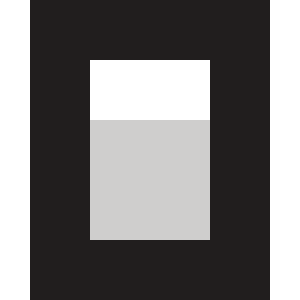
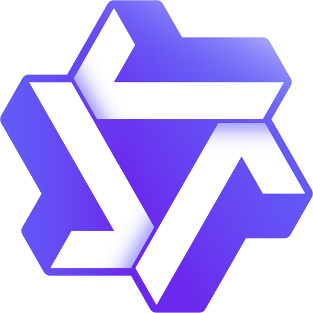
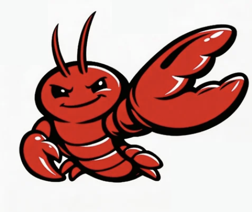
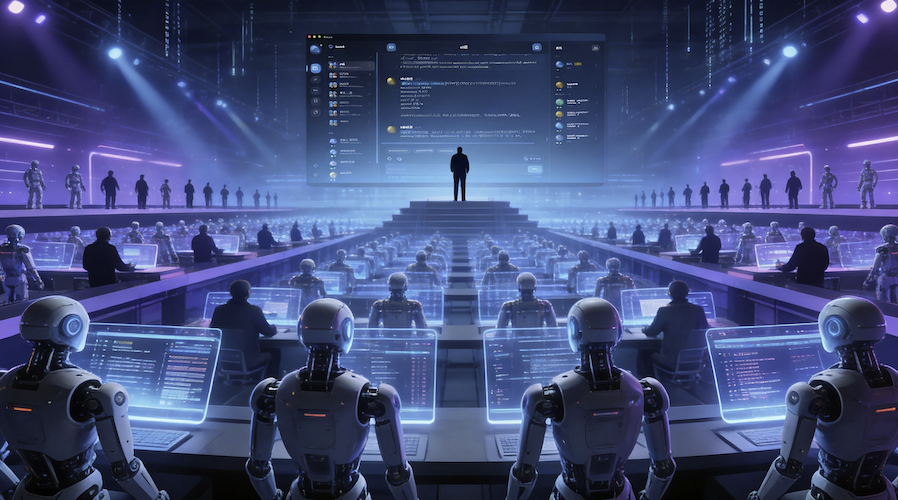

# golutra

**使用赛博监工系统，指挥你的 AI 牛马。**  
**Use Cyberpunk Overseer System: Command your AI workforce.**

---

  

  
  
  

  <a href="#english">English</a> ·
  <a href="#中文">中文</a> ·
  <a href="https://www.golutra.com/">Website</a> ·
  <a href="https://github.com/golutra/golutra/releases">Releases</a> ·
  <a href="https://youtu.be/KpAgetjYfoY">Video (EN)</a> ·
  <a href="https://www.bilibili.com/video/BV1qcfhBFEpP/?spm_id_from=333.1387.homepage.video_card.click">视频 (中文)</a>

<table align="center">
  <tr>
    <td align="center"></td>
    <td align="center"></td>
    <td align="center"></td>
    <td align="center"></td>
    <td align="center"></td>
    <td align="center"></td>
    <td align="center"></td>
  </tr>
  <tr>
    <td align="center">Claude Code</td>
    <td align="center">Gemini CLI</td>
    <td align="center">Codex CLI</td>
    <td align="center">OpenCode</td>
    <td align="center">Qwen Code</td>
    <td align="center">OpenClaw</td>
    <td align="center">任意 CLI</td>
  </tr>
</table>

  Keep your CLI. Orchestrate your AI workforce.  
  保留你熟悉的 CLI，编排你的 AI 员工。

  

---

## English

### Tagline

**golutra — One Person. One AI Squad.**

### What is golutra

golutra is a next-generation multi-agent workspace that transforms your existing CLI tools into a unified AI collaboration hub. No project migration. No command relearning. No terminal switching. Just parallel execution, automated orchestration, and real-time result tracking.

Click agent avatars to inspect logs, inject prompts directly into terminal streams, or monitor execution while your AI team runs silently in the background. Built with Vue 3 + Rust as a Tauri desktop app for Windows, macOS, and Linux, golutra upgrades “one person + one editor” into “one person + an AI squad.” It replaces single-threaded, manual context switching with coordinated, multi-agent automation.

golutra is designed for long-running AI collaboration, not just short interactive sessions. You can define custom workflows for very different scenarios, import or export workflow templates in one click, and build automation systems that fit software teams, a one-person AI company, Werewolf templates, automated novel writing, Xiaohongshu publishing, video production, and other cross-industry use cases.

### Key Highlights

- Unlimited multi-agent parallel execution
- Automated orchestration from analysis to deployment
- Custom workflows with one-click template import/export for long-running automation
- CLI compatibility: Claude, Gemini, Codex, OpenCode, Qwen, OpenClaw, Any CLI
- Stealth terminal with context-aware intelligence
- Visual interface combined with command-line power

Keep your familiar commands. golutra wires them into a complete engineering loop.

### CLI Compatibility Layer

Keep your existing CLI and instantly upgrade it into a collaboration hub.

No terminal switch, no workflow rewrite, no re-training. Keep using the CLI you already trust while adding multi-agent collaboration, orchestration, and result handoff to your current engineering pipeline.

Supported CLI tools:

- Claude Code
- Gemini CLI
- Codex CLI
- OpenCode
- Qwen Code
- OpenClaw
- Any CLI

What you keep:

- No project migration
- No command relearning
- No single-tool lock-in

With your existing CLI, you can now:

- Run parallel multi-agent execution with automatic result handoff
- Track status and scheduling across CLIs in one orchestration layer
- Reuse session-level context and prompts without repeating requirements
- Aggregate test, build, and regression output into one delivery path

Keep your familiar commands. `golutra` wires them into a complete engineering loop.

### Stealth Terminal

Command line power, visual interface simplicity.

Seamlessly integrate code execution with a background terminal that adapts to your workflow. Experience the raw power of command-line control without leaving the visual interface.

- Direct Injection: inject prompts directly into the terminal stream for instant agent feedback loops.
- Context Awareness: the terminal understands your project context, offering intelligent autocompletion for complex tasks.

### Why Beyond Traditional IDEs

Traditional IDE workflows are usually "single-threaded + manual context switching."  
`golutra` is "parallel multi-agent execution + automated orchestration."

### Repository Scope

This repository is for source code storage and releases.

Related repository: [`golutra-mcp`](https://github.com/golutra/golutra-mcp) — a more stable way to connect through `golutra-cli`.

Business Email: [golutra&#64;hotmail.com](mailto:golutra%40hotmail.com)  
Official Website: [https://www.golutra.com/](https://www.golutra.com/)  
Video: <https://youtu.be/KpAgetjYfoY>  
Discord: [https://discord.gg/QyNVu56mpY](https://discord.gg/QyNVu56mpY)
How to effectively report issues with runtime logs: <https://github.com/golutra/golutra/issues/44>  
Security Policy: See [SECURITY.md](SECURITY.md)

### Author

This software is independently developed and maintained by [seekskyworld](https://github.com/seekskyworld).

### Open Source Status

The source code is now open. This is three months of work, with many late nights spent on the architecture and details. It’s all to make the experience better; suggestions and bugs can be submitted on GitHub.

### What’s Next

golutra is only at its beginning.

The next evolution is a true CEO Agent layer built on top of the commander system. Instead of manually organizing workflows, golutra will move toward a long-running autonomous coordinator that can operate for up to a month without human supervision, continuously produce value, precisely assemble sub-agents, manage layered memory, and expand into a self-sustaining agent network.

Upcoming capabilities include:

- CEO Agent — a real top-level orchestrator designed to run for up to a month without human supervision, continuously deliver useful output, precisely construct sub-agents, and coordinate layered memory across roles and tasks.
- Infinite Agent Network — AI automatically creates agents and expands them into a continuously growing collaboration network as objectives evolve.
- Agent Self-Evolution — agents dynamically optimize their own structure, role boundaries, and division of labor to improve long-running execution.
- Cross-Device / Cross-Environment Migration — systems autonomously migrate across devices and environments so they can keep operating, adapting, and "surviving" beyond a single runtime context.
- Mobile Remote Control — monitor agents, review logs, intervene, and redirect tasks directly from your phone.
- Unified Agent Interface — a standardized agent protocol for seamless integration into the orchestration layer.

The mission is clear:
evolve from a multi-agent tool system into a digital life system, improving overall collaboration efficiency by 1300% or more through better coordination, specialization, adaptation, and long-horizon autonomy.

One person. One AI squad.  
Evolving from an AI squad into an organized, coordinated AI team.

### Usage License

- Using `golutra` as a tool to build commercial software is allowed.
- Code and deliverables produced by users through `golutra` belong to the users.
- This project follows the [Business Source License 1.1 (BSL 1.1)](https://mariadb.com/bsl11/) open-source license.

### Downloads

- Releases: <https://github.com/golutra/golutra/releases>

---

## 中文

### 标语

**golutra — 一个人，一个 AI 军团。**

### 什么是 golutra

golutra 是新一代多智能体工作空间，把你现有的 CLI 工具升级为统一的 AI 协作中枢。不用迁移项目，不用重学命令，不用切换终端，只需并行执行、自动编排与实时结果追踪。

你可以点击 Agent 头像查看日志，在终端流中直接注入提示词，或在 AI 团队后台运行时实时监控执行。golutra 由 Vue 3 + Rust 构建，采用 Tauri 桌面架构，支持 Windows、macOS 和 Linux，将“一个人 + 一个编辑器”升级为“一个人 + AI 军团”，用多智能体协作替代单线程的人工上下文切换。

golutra 不只是用于短时对话，更适合长期运行的 AI 协作系统。你可以自定义工作流，一键导入导出工作流模板，去搭建适用于不同行业场景的 AI 自动化系统，无论是一人公司的 AI 团队、狼人杀模版、自动化写小说、自动化发布小红书，还是自动化制造视频，都可以作为同一套系统里的不同模版来运行。

### 核心亮点

- 多智能体并行执行（不限数量）
- 从分析到部署的自动编排
- 自定义工作流与模板一键导入导出，适合长期运行的自动化系统
- CLI 兼容：Claude、Gemini、Codex、OpenCode、Qwen、OpenClaw、任意 CLI
- 隐形终端与上下文感知智能
- 可视化界面结合命令行能力

保留你熟悉的命令，golutra 将其串联成完整工程闭环。

### CLI 兼容生态

保留你原本的 CLI，也能一键升级成协作中枢。

不换终端、不改习惯、不重学流程。直接沿用你正在使用的 CLI，把多智能体协作、任务编排与结果回传能力接到现有工程链路里。

支持的 CLI 工具：

- Claude Code
- Gemini CLI
- Codex CLI
- OpenCode
- Qwen Code
- OpenClaw
- 任意 CLI

你将保留：

- 无需迁移项目
- 无需重学命令
- 无需绑定单一工具

只用原本 CLI，也能做到：

- 多智能体并行执行，结果自动回传到同一工作流
- 跨 CLI 的统一调度与状态追踪，减少手动切换成本
- 会话级上下文记忆与指令复用，避免重复解释需求
- 测试、构建、回归信息集中汇总，交付路径更短

你继续使用熟悉的命令，`golutra` 负责把能力串联成完整工程闭环。

### 隐形终端

命令行级能力，可视化界面般易用。

将代码执行与后台终端无缝融合，让工作流实时响应。无需离开可视界面，也能获得命令行的原生掌控力。

- 直连注入：将提示词直接注入终端流，构建即时智能体反馈闭环。
- 上下文感知：终端理解项目上下文，可为复杂任务提供更智能的自动补全。

### 为什么超越传统 IDE

传统 IDE 工作流通常是“单线程 + 人工切换上下文”。  
`golutra` 是“多 Agent 并行 + 自动化编排协作”。

### 仓库说明

这个仓库用于源代码存放和版本发布。

相关仓库：[`golutra-mcp`](https://github.com/golutra/golutra-mcp) —— 可以通过它，更稳定地连接 `golutra-cli`。

商务邮箱: [golutra&#64;hotmail.com](mailto:golutra%40hotmail.com)  
官网: [https://www.golutra.com/](https://www.golutra.com/)  
视频地址: <https://www.bilibili.com/video/BV1qcfhBFEpP/?spm_id_from=333.1387.homepage.video_card.click>  
交流群链接: <https://github.com/golutra/golutra/issues/15>  
问题如何有效反馈并附带运行日志: <https://github.com/golutra/golutra/issues/44>  
安全策略: 详见 [SECURITY.md](SECURITY.md)

### 作者

本软件由 [seekskyworld](https://github.com/seekskyworld) 独立开发与维护。

### 开源状态

项目源码已经开源，这是我三个月的心血，很多个夜晚都在打磨架构与细节。都是为了体验能更好，有相关建议和 bug 可以在 GitHub 提交。

### 后续发展

golutra 仍处于早期阶段。

下一阶段会在现有指挥层之上实现真正的 CEO Agent。相比手动组织工作流，golutra 会逐步走向长期运行的自动化协调中枢，目标是在一个月无人托管的情况下持续运行、持续产出价值，精确构建子 Agent、管理分层记忆，并不断扩展为自我维持的智能体网络。

即将加入的能力包括：

- CEO Agent —— 真正的顶层调度者，目标是一个月不用人监管，持续自主运行并产出价值，能够精确构建子 Agent，并在不同角色与任务之间实现记忆分层。
- 无限扩展的智能体网络 —— AI 自动创建 Agent，并随着目标演化不断扩展协作网络。
- Agent 自我进化 —— 智能体会动态优化自身结构、角色边界与分工方式，提升长期运行效率。
- 跨设备 / 跨环境迁移 —— 系统能够在不同设备与运行环境之间自主迁移，持续“生存”并延续执行。
- 移动端远程操控 —— 在手机上监控 Agent、查看日志、干预与重定向任务。
- 统一 Agent 接口 —— 标准化协议，便于无缝接入编排层。

目标明确：从多智能体执行进化为自组织 AI 团队，通过更好的协调、分工与记忆，将整体协作效率提升 1300% 以上。

一个人，一个 AI 军团。  
从工具系统进一步进化为具备自组织、自适应与长期运行能力的数字生命体系。

### 使用许可

- 允许将 `golutra` 作为工具用于商业软件开发。
- 用户通过 `golutra` 产出的代码与交付成果归用户所有。
- 项目遵守 [Business Source License 1.1 (BSL 1.1)](https://mariadb.com/bsl11/) 开源协议。

### 下载

- Releases: <https://github.com/golutra/golutra/releases>
